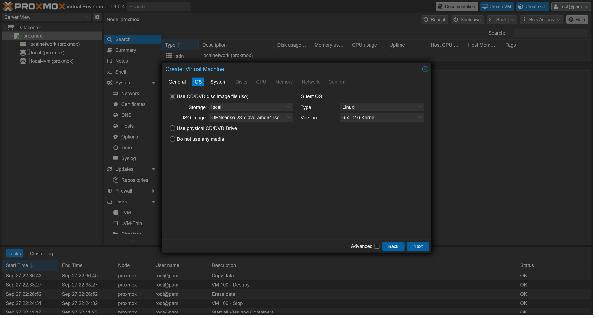

# Homelab

This repository serves as a guide for the creation of a personal homelab, with the objective of learning and testing technologies. The points defined here should not necessarily be followed without modifications, since it only meets my personal needs. Anyway it should still serve as a good starting point and inspiration.

## Hardware
 - Internet 600Mbps
 - Mini PC Intel Core i7-10700 16GB 512GB SSD with 2 NICs 1GbE
 - Switch TP-Link TL-SG1210P
 - Access Point TP-Link EAP660 HD

## Installation
### Proxmox
Before we begin our infrastructure looks like this:

In my case the ISP Router is using 192.168.1.1/24 for the DHCP server. I will connect the interface enp2s0 to the router and use the IP 192.168.1.100 for the Proxmox server. We will change this IP later to be served by the internal OPNsense server.

The first thing necessary is to configure the BIOS of the machine to enable virtualization. In my case, I had to enable the following options:
 - Intel Virtualization Technology
 - Intel VT-d
 - Intel VT-x

After that, we can proceed with the installation of Proxmox. To do this, we need to download the ISO from the [official website](https://www.proxmox.com/en/downloads/category/iso-images-pve) and burn it to a USB stick. Then we need to boot from the USB stick and follow the installation steps.

This is the screen when you first boot from the USB stick. Choose `Install Proxmox VE (Graphical)`:

Click to accept the license agreement:

Choose where to install the server, in my case I will choose the entire nvme disk with the ext4 file system:

Choose the country, time zone and keyboard layout:

Choose the password for the root user:

Choose the NIC interface, hostname, IP address, gateway and DNS server. In my case this will be:
 - Interface: enp2s0
 - Hostname: proxmox.mfurlanetto.com
 - IP: 192.168.1.100/24
 - Gateway: 192.168.1.1
 - DNS: 1.1.1.1

Click in `Install` to start the installation.

The installation will take a few minutes:

When the installation is finished, remove the USB stick and reboot the machine.

When the machine boots, you will see the following screen with the URL to access the server:

After acessing the URL you will probably see a warning about the self signed certificate, click to proceed anyway:

Login with the root user and the password you defined during the installation:

After login you will see an error about the subscription, click in `OK`:

Now we're going fix the error we saw earlier and update the Proxmox node.

Choose `proxmox` in the side menu and then click in `Repositories`. Disable the ceph and pve-enterprise repositories:

Click in add and choose the `No Subscription` option:

Now to update the Proxmox node click in `Updates` and `Refresh`. And finally click in `Upgrade`:

I my case there's was a kernel update, so I had to reboot the machine clicking in `Reboot` in the top right corner:

That's it, now we have a Proxmox server ready to use.

### OPNsense

Now we can start to think about our network setup. For security purposes we will add a firewall between the ISP Router and the Proxmox server. My firewall of choice is OPNsense, but you can use any other firewall you want.

Like I said earlier my Mini PC has two NICs, `enp2s0` and `enp3s0`. The first one will be our WAN and the second one our LAN. When we installed Proxmox created by default a bridge called `vmbr0` that is using the `enp2s0` interface. We will created another one for `enp3s0` called `vmbr1` that will be our trunk port.

To segregate the traffic we will use VLANs. I like to configure the following:
 - HOME_VLAN:
    - ID: 10
    - DHCP: 10.0.10.1/24
    - Reason: Network for personal devices like computers, phones, etc.
 - GUEST_VLAN:
    - ID: 20
    - DHCP: 10.0.20.1/24
    - Reason: Network for guests, like friends and family.
 - IOT_VLAN:
    - ID: 30
    - DHCP: 10.0.30.1/24
    - Reason: Devices that I don't trust like smart TVs, smart speakers, etc.
 - MGMT_VLAN:
    - ID: 99
    - DHCP: 10.0.99.1/24
    - Reason: Network for servers and management interfaces.

Using OPNsense inside Proxmox isn't the best solution considering that if the OPNsense VM goes down we will lose the Proxmox access, but it's a risk I'm willing to take.

To install OPNsense we need to download the ISO from the [official website](https://opnsense.org/download/).

Click in `local(proxmox)`, `ISO Images` and finally in `Upload` and choose the ISO file you downloaded earlier:

As we are here let's also configure the network interfaces. First we will create the trunk interface for our LAN. In the left panel click in `proxmox`, `System`, `Network`, `Create` and choose `Linux Bridge`. My bridge will be named `vmbr1`, the port will be `enp3s0` and the VLAN aware option will be checked. Click in `Create`:

Now we will create the interfaces for the VLANs. Click in `Create` and choose `Linux VLAN`. The name will be `vmbr1.10` and the description `HOME_VLAN`. Make sure `Autostart` is checked and click in `Create`:

I will do the same for the other VLANs. The end result should be like this:

Click in `Apply Configuration` to apply the changes.

Now let's create the VM. In the top bar click in `Create VM`. 

In General use `opnsense` for name:

In OS choose the OPNsense ISO we uploaded earlier:

In System don't change anything:

In Disks change size to 16GB:

In CPU change cores to 2:

In Memory change size to 2048MiB:

In Network we can only choose one nic, so leave `vmbr0` for now. Make sure to disable firewall:

Make sure the `Start after created` option is not checked and click in `Finish`.

In the left bar click in `opnsense` and then in `Hardware`. Click in `Add` and choose `Network Device`:

Choose `vmbr1`, disable firewall and click in `Add`:

So `vmbr0` will be used for the WAN interface and `vmbr1` for the LAN interface. Now we can start the VM. Click in `Start` in the top bar and enter the console:

Wait for the OS to boot and login with:
 - Username: installer
 - Password: opnsense

Choose the keyboard layout, in my case `Brazilian (accent keys)`:

Choose `Install (UFS)`:

Select `da0` for disk:

Select `YES`: to continue:

Wait for the installation to finish. Choose `Change root password`:

Choose a strong password. Now select `Complete Install` to reboot:

Don't forget to remove the installation media:

Wait for the VM to restart. After the restart you will see the following screen:

Login using:
 - Username: root
 - Password: the password you defined earlier

OPNsense choosed the wrong interfaces for WAN and LAN and I want to change the IP address for LAN. Let's fix that.

Choose option `2) Set interface IP address`:

Now OPNsense will ask some questions:

 - Enter the number of the interface to configure: 1
 - Configure IPv4 address LAN interface via DHCP? (y/N): N
 - Enter the new LAN IPv4 address: 10.0.0.1
 - Enter the new LAN IPv4 subnet bit count (1..32): 24
 - For a LAN, press <ENTER> for none: Enter
 - Configure IPv6 address LAN interface via WAN tracking? (Y/n): n
 - Configure IPv6 address LAN interface via DHCP6? (y/N): N
 - Enter the new LAN IPv6 address: Enter
 - Do you want to enable the DHCP server on LAN? (y/N): y
 - Enter the start address of the IPv4 client address range: 10.0.0.50
 - Enter the start address of the IPv4 client address range: 10.0.0.254
 - Do you want to change the web GUI protocol from HTTPS to HTTP? (y/N): N
 - Do you want to generate a new self-signed web GUI certificate? (y/N): N
 - Restore web GUI accress defaults? (y/N): N

